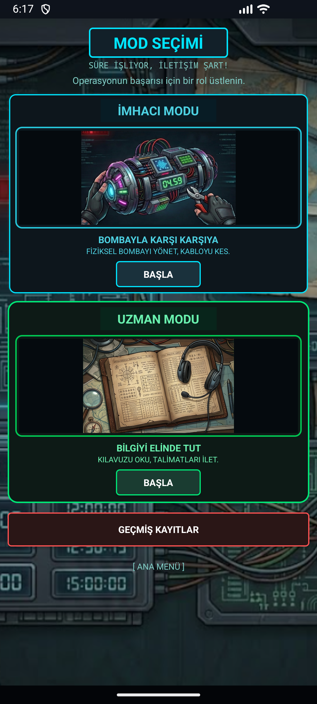

# Bomba İmha Oyunu

Android tabanlı, iki rollü ve zaman baskısına dayanan bir bomba imha oyunudur. Bir oyuncu **imhacı** olarak bomba panelindeki modülleri çözer; diğer oyuncu **uzman/kılavuz** rolünde rehber ekranlarından kuralları okuyarak doğru yönlendirmeleri verir.

Oyunun amacı, 5 dakikalık geri sayım bitmeden ve 3 hata hakkı dolmadan tüm modülleri çözmektir.



## Özellikler

- İki ayrı oyun rolü: imhacı ve uzman/kılavuz.
- Beş farklı bomba modülü: kablo, büyük düğme, renk hafıza, kadran ve şifre paneli.
- Seri numarası, pil sayısı ve indicator bilgisine göre değişen kural tabanlı oyun mantığı.
- Yedi segment görünümlü özel geri sayım sayacı.
- Son 2.5 dakikada kırmızı uyarı overlay'i ile zaman baskısı efekti.
- Kazanma, kaybetme, patlama bildirimi ve sonuç ekranı.
- SQLite ile yerel skor geçmişi.
- Şifre modülünde API'den kelime alma; bağlantı yoksa yerel fallback kelime listesi.

## Oyun Akışı

1. Oyuncu açılış ekranından rol seçimine geçer.
2. İmhacı rolü oyuncu adını alır ve yeni oyun başlatır.
3. Bomba panelinde süre, hata sayısı, bomba bilgileri ve modül kartları gösterilir.
4. Modüller doğru kurallarla çözüldükçe tamamlandı olarak işaretlenir.
5. Tüm modüller çözülürse görev başarılı olur; süre biterse veya hata limiti aşılırsa oyun kaybedilir.
6. Sonuç ekranında skor, kalan süre, hata sayısı ve modül ilerlemesi gösterilir.

## Modüller

| Modül | Kısa Açıklama |
| --- | --- |
| Kablo | Kablo sayısı, renkler ve seri numarasına göre doğru kablo seçilir. |
| Büyük Düğme | Düğme rengi, yazısı, pil sayısı ve indicator değerine göre basma veya basılı tutma kararı verilir. |
| Renk Hafıza | Yanan renk, hata sayısı ve seri numarası bilgisine göre üç aşamalı renk sırası çözülür. |
| Kadran | Seri numarası, pil sayısı ve indicator bilgisiyle doğru yön dizisi takip edilir. |
| Şifre Paneli | Güvenlik kelimesi ve bomba bilgileriyle hesaplanan PIN girilir. |

## Kullanılan Teknolojiler

- Java 11
- Android XML arayüzleri
- Android SDK: min 27, target 36, compile 36
- AndroidX AppCompat, Material, Activity ve ConstraintLayout
- CountDownTimer, Handler/Looper, Intent ve Activity yapısı
- SQLiteOpenHelper ile yerel veri saklama
- SharedPreferences ile oyuncu adı saklama
- HttpURLConnection ile internet tabanlı güvenlik kelimesi alma

## Proje Yapısı

```text
app/src/main/java/com/example/codedefuse
|-- WelcomeActivity.java
|-- RoleSelectionActivity.java
|-- DefuserSetupActivity.java
|-- BombActivity.java
|-- GameState.java
|-- *ModuleActivity.java
|-- *GuideActivity.java
|-- ResultActivity.java
|-- ScoreHistoryActivity.java
|-- DatabaseHelper.java
`-- SevenSegmentTimerView.java
```

## Çalıştırma

Projeyi Android Studio ile açıp Gradle senkronizasyonunu tamamladıktan sonra uygulamayı bir emülatörde veya Android cihazda çalıştırabilirsiniz.

Komut satırından test çalıştırmak için:

```bash
./gradlew test
```

Windows için:

```powershell
.\gradlew.bat test
```

## Geliştirme Notları

Proje Activity merkezli klasik Android mimarisiyle geliştirilmiştir. Oyun durumu `GameState` sınıfında merkezi olarak tutulur; skor kayıtları `DatabaseHelper` üzerinden SQLite veritabanına yazılır. Görsel tasarımda koyu teknoloji teması, neon vurgular, özel drawable dosyaları ve tematik bitmap görseller birlikte kullanılmıştır.

Gelecekte gerçek zamanlı çok oyunculu bağlantı, zorluk seviyeleri, yeni modüller, ses/titreşim geri bildirimi ve modül algoritmaları için daha kapsamlı birim testleri eklenebilir.

## Hazırlayanlar

- Şevval Ayça Çerence
- Merve Selçuk
